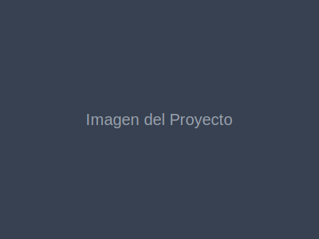
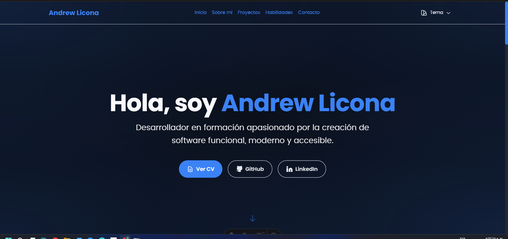
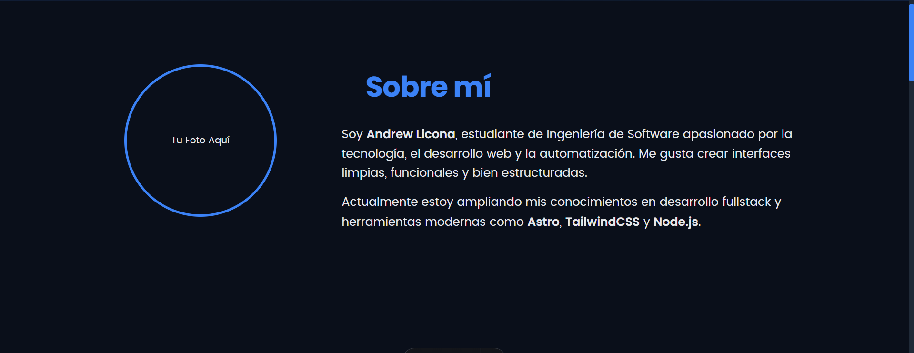
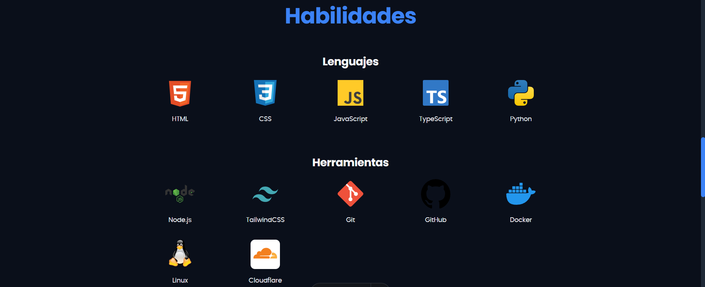
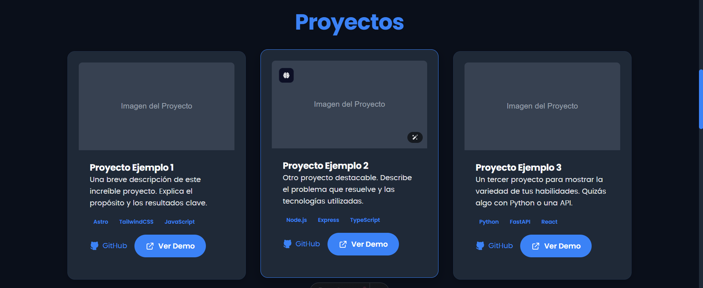
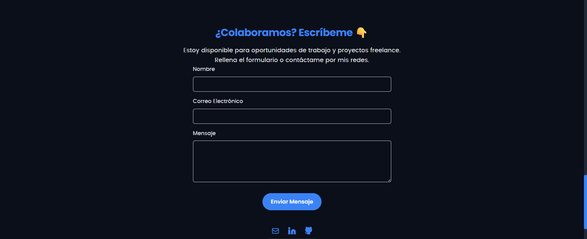

# Mi Portafolio Personal

¡Bienvenido a mi portafolio personal! Este proyecto showcase mis habilidades y proyectos como desarrollador.

## Tecnologías Utilizadas

Este proyecto está construido utilizando las siguientes tecnologías principales:

<!-- Aquí puedes añadir iconos de las tecnologías, por ejemplo:  -->

* **Astro**: Un framework web moderno para construir sitios web rápidos y centrados en el contenido.
* **Tailwind CSS**: Un framework CSS utility-first para construir diseños personalizados rápidamente.
* **Autoprefixer**: Un postprocesador CSS que añade prefijos de proveedor a las reglas CSS.
* **PostCSS**: Una herramienta para transformar CSS con plugins de JavaScript.

## Instalación y Uso

Sigue estos pasos para configurar y ejecutar el proyecto localmente:

1. **Clona el repositorio:**

    ```bash
    git clone https://github.com/tu-usuario/mi-portafolio.git
    cd mi-portafolio
    ```

2. **Instala las dependencias:**

    ```bash
    npm install
    ```

3. **Inicia el servidor de desarrollo:**

    ```bash
    npm run dev
    ```

    Esto iniciará el servidor de desarrollo en `http://localhost:4321` (o un puerto similar).

4. **Construye el proyecto (opcional):**

    ```bash
    npm run build
    ```

    Esto generará los archivos estáticos para producción en la carpeta `dist/`.

## Proyectos

Aquí hay algunos de los proyectos en los que he trabajado. (Nota: Estos son proyectos de ejemplo. Por favor, reemplázalos con tus proyectos reales).

### Proyecto Ejemplo 1

Una breve descripción de este increíble proyecto. Explica el propósito y los resultados clave.



**Tecnologías:** Astro, TailwindCSS, JavaScript

* [GitHub](https://github.com/andrewlicona)
* [Demo](https://enlacedeejemplo.com)

### Proyecto Ejemplo 2

Otro proyecto destacable. Describe el problema que resuelve y las tecnologías utilizadas.


**Tecnologías:** Node.js, Express, TypeScript

* [GitHub](https://github.com/andrewlicona)
* [Demo](https://enlacedeejemplo.com)

### Proyecto Ejemplo 3

Un tercer proyecto para mostrar la variedad de tus habilidades. Quizás algo con Python o una API.


**Tecnologías:** Python, FastAPI, React

* [GitHub](https://github.com/andrewlicona)
* [Demo](https://enlacedeejemplo.com)

## Componentes Principales del Portafolio

Aquí se describen los componentes principales que conforman este portafolio, con sugerencias para capturas de pantalla de cada sección:

### Hero Section

La sección de bienvenida o "Hero" es la primera impresión del portafolio, a menudo incluyendo un saludo, tu nombre y una breve descripción de tu rol o lo que haces.



### About Section

Esta sección proporciona más detalles sobre ti, tu experiencia, tu trayectoria y tus intereses.



### Skills Section

Aquí se listan las habilidades técnicas y herramientas que dominas, a menudo categorizadas o con iconos representativos.



### Projects Section

Esta sección muestra tus proyectos más destacados, con descripciones, tecnologías utilizadas y enlaces a demos o repositorios.



### Contact Section

La sección de contacto permite a los visitantes comunicarse contigo, incluyendo enlaces a redes sociales, correo electrónico o un formulario de contacto.



## Contacto

¡Me encantaría conectar contigo! Puedes encontrarme en:

* **LinkedIn:** [Mi perfil de LinkedIn](https://www.linkedin.com/in/andrewliconablanco)
* **GitHub:** [Mi perfil de GitHub](https://github.com/andrewlicona)
* **Correo Electrónico:** [andrewlicona70@gmail.com](mailto:andrewlicona70@gmail.com)
